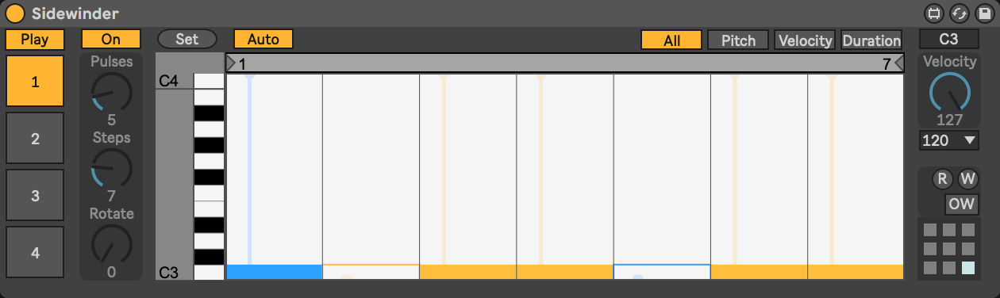
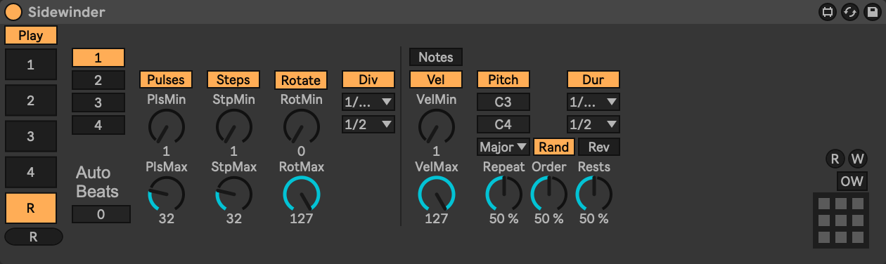

# Sidewinder

Sidewinder is an Euclidean sequencer for [Max for Live](https://www.ableton.com/en/live/max-for-live/) that creates polyrhythms. Sidewinder takes a number of pulses (notes) and positions them as equidistant as possible into a number of steps. Equidistant distribution is a key to creating rhythms that are inherently musical. Many traditional rhythms can be generated through this simple process, see the [example rhythms](#example-rhythms) section.

The [Euclidean algorithm](https://en.wikipedia.org/wiki/Euclidean_algorithm) computes greatest common divisor of two numbers. Godfried Toussaint discovered its musical applications and published them in ["The Euclidean Algorithm Generates Traditional Musical Rhythms"](http://cgm.cs.mcgill.ca/~godfried/publications/banff.pdf). Applied to music, the algorithm takes `k` pulses (notes) and distributes them as equidistant as possible in `n` steps.

## Interface

### Global

- **Play**: Toggle playback
- **1-4 Tabs**: Select which track to display
- **R Tab**: Display the randomize pan
- **R**: Trigger randomize

#### Presets

- **R**: Read presets from a file
- **W**: Write the presets to a file
- **OW**: When toggled on, **W** will automatically write again to the same file
- To recall a preset, click a box
- To save a preset, shift-click a box
- To delete a preset, shift-option-click a box

### Tracks

- **On**: Toggle playback for this track
- **Set**: Set the steps based on the current settings
- **Auto**: Toggle whether moving a control automatically updates the steps
- Type Tabs: Select between showing **All**, **Pitch**, **Velocity**, or  **Duration** in the step sequencer.

When **Auto** is on, making a change automatically updates the steps. When **Auto** is off, use **Set** to update the steps.

**Note:** Due to a technical limitation, if Auto is on, changing *any* parameter that affects the steps (e.g., pulses, steps, rotate, pitch, velocity, or duration) *will overwrite any manual changes made in the step sequencer to pitch, velocity, or duration*.

#### Pulses

- **Pulses**: Set the number of pulses (notes)
- **Steps**: Set the total number of steps
- **Rotate**: Set the offset for the pulses

#### Notes

- **Pitch:** Set the pitch of the notes
- **Velocity**: Set the velocity of the notes
- **Duration**: Set the duration of the notes in DAW ticks. The duration can only be set to `7.5`, `15`, `30`, `60`, `120`, `240`, `480`, or `960`. This is limitation of the [`live.step`](https://docs.cycling74.com/max8/refpages/live.step) sequencer.

### Randomize

Randomize generates a random sequence. The **Notes** setting is significant, with that setting turned off, a sequence that plays a single note will be generated. If it's turned on, a sequence playing different notes from a scale will be generated.

- **1-4 Buttons:** Which tracks to randomize
- **Pulses, Steps, Rotate:** Whether to randomize those parameters
- **Min:** Minimum random amount
- **Max:** Maximum random amount
- **Notes**: Whether to randomize individual notes. If the notes is off, then randomize for Velocity, Pitch, and Duration will randomize changing those values on the individual track settings. If notes is on, then randomize for those values will create randomize the individual notes (and the track settings will be used for default values, e.g., for off notes with a velocity of 0).
- For Duration, the top number and bottom numbers are the minimum and maximum duration in ticks
- For Pitch, the top number and bottom pitches are the minimum and maximum pitches

#### Pitch Note Controls

With the **Notes** is off, only the minimum and maximum pitches are used. If **Notes** is on, Sidewinder generates a note sequence and provides additional parameters to randomize the sequence. If all the additional randomization parameters are off, the sequence generated will simply generate notes in the selected scale in order.

- **Scale:** The scale the sequence will be generated in
- **Rev:** Reverse the order of the generated sequence (from ascending to descending)
- **Repeat, Order, Rests:** The percentage chance that each note will be affected when generating the note sequence. Repeat is the percentage chance each note will be repeated, Order is the percentage change each note will be have it's position in the sequence randomized, and Rests is the percentage chance the note will be replaced by a rest.

## Installation

Drag `max-for-live/Sidewinder.amxd` to `Ableton/User Library/Presets/MIDI Effects/Max MIDI Effect/`. There's an optional `install.sh` script that will do this automatically.

## Source Files

To open any of the `maxpat` files, the Sidewinder folder should be in your [Project Search Paths](https://docs.cycling74.com/max8/vignettes/projects_searchpath), `~/Documents/Max 8/Projects` by default, so that referenced files can be found.

## JavaScript Implementation

Two JavaScript implementations of the algorithm are included (annotated as [Literate CoffeeScript](http://coffeescript.org/#literate)):

- [`bjorklund.litcoffee`](source/src/coffee/bjorklund.litcoffee): This follows the description of the algorithm verbatim from ["Structural properties of Euclidean rhythms"](http://student.ulb.ac.be/~ptaslaki/publications/structuralProperties.pdf), but it also gets slightly different results than the examples listed in Toussaint's other paper.
- [`toussaint.litcoffee`](source/src/coffee/toussaint.litcoffee): This version is slightly more elegant, and it's corrected to get identical results to the examples listed in ["The Euclidean Algorithm Generates Traditional Musical Rhythms"](http://cgm.cs.mcgill.ca/~godfried/publications/banff.pdf).

The sequencer uses the `toussaint` version by default.

## Example Rhythms

["The Euclidean Algorithm Generates Traditional Musical Rhythms"](http://cgm.cs.mcgill.ca/~godfried/publications/banff.pdf) contains a number of example inputs (`k` and `n`) that result in traditional rhythms:

- `E(2,3) = [x . x]` is a common Afro-Cuban drum pattern. For example, it is the conga rhythm of the 6/8-time Swing Tumbao. It is also common in Latin American music, as for example in the Cueca.
- `E(2,5) = [x . x . .]` is a thirteenth century Persian rhythm called Khafif-e-ramal. It is also the metric pattern of the second movement of Tchaikovsky’s Symphony No. 6. When it is started on the second onset (`[x . . x .]`) it is the metric pattern of Dave Brubeck’s Take Five as well as Mars from The Planets by Gustav Holst.
- `E(3,4) = [x . x x]` is the archetypal pattern of the Cumbia from Colombia [20], as well as a Calypso rhythm from Trinidad. It is also a thirteenth century Persian rhythm called Khalif-e-saghil, as well as the trochoid choreic rhythmic pattern of ancient Greece.
- `E(3,5) = [x . x . x]`, when started on the second onset, is another thirteenth century Persian rhythm by the name of Khafif-e-ramal, as well as a Rumanian folk-dance rhythm.
- `E(3,7) = [x . x . x . .]` is a Ruchenitza rhythm used in a Bulgarian folk-dance. It is also the metric pattern of Pink Floyd’s Money.
- `E(3,8) = [x . . x . . x .]` is the Cuban tresillo pattern discussed in the preceding.
- `E(4,7) = [x . x . x . x]` is another Ruchenitza Bulgarian folk-dance rhythm. > `E(4,9) = [x.x.x.x..]` is the Aksak rhythm of Turkey. It is also the metric pattern used by Dave Brubeck in his piece Rondo a la Turk.
- `E(4,11) = [x . . x . . x . . x .]` is the metric pattern used by Frank Zappa in his piece titled Outside Now. `E(5,6) = [x . x x x x]` yields the York-Samai pattern, a popular Arab rhythm, when started on the second onset.
- `E(5,7) = [x . x x . x x]` is the Nawakhat pattern, another popular Arab rhythm.
- `E(5,8)=[x . x x . x x .]` is the Cuban cinquillo pattern discussed in the preceding. When it is started on the second onset it is also the Spanish Tango and a thirteenth century Persian rhythm, the Al-saghil- al-sani.
- `E(5,9) = [x . x . x . x . x]` is a popular Arab rhythm called Agsag-Samai. When started on the second onset, it is a drum pattern used by the Venda in South Africa, as well as a Rumanian folk-dance rhythm.
- `E(5,11) = [x . x . x . x . x . .]` is the metric pattern used by Moussorgsky in Pictures at an Exhibition. `E(5,12) = [x . . x . x . . x . x .]` is the Venda clapping pattern of a South African children’s song.
- `E(5,16) = [x..x..x..x..x....]` is the Bossa-Nova rhythm necklace of Brazil. The actual Bossa-Nova rhythm usually starts on the third onset as follows: `[x . . x . . x . . . x . . x . .]`. However, there are other starting places as well, as for example `[x . . x . . x . . x . . . x . .]`.
- `E(7,8) = [x . x x x x x x]` is a typical rhythm played on the Bendir (frame drum), and used in the accompaniment of songs of the Tuareg people of Libya.
- `E(7,12) = [x . x x . x . x x . x .]` is a common West African bell pattern. For example, it is used in the Mpre rhythm of the Ashanti people of Ghana.
- `E(7,16) = [x . . x . x . x . . x . x . x .]` is a Samba rhythm necklace from Brazil. The actual Samba rhythm is `[x . x . . x . x . x . . x . x .]` obtained by starting `E(7,16)` on the last onset. When `E(7,16)` is started on the fifth onset it is a clapping pattern from Ghana.
- `E(9,16) = [x.xx.x.x.xx.x.x.]` is a rhythm necklace used in the Central African Republic. When it is started on the fourth onset it is a rhythm played in West and Central Africa, as well as a cow-bell pattern in the Brazilian samba. When it is started on the penultimate onset it is the bell pattern of the Ngbaka-Maibo rhythms of the Central African Republic.
- `E(11,24) = [x . . x . x . x . x . x . . x . x . x . x . x .]` is a rhythm necklace of the Aka Pygmies of Central Africa [2]. It is usually started on the seventh onset.
- `E(13,24) = [x . x x . x . x . x . x . x x . x . x . x . x .]` is another rhythm necklace of the Aka Pygmies of the upper Sangha. It is usually started on the fourth onset.

## Ableton Push

Sidewinder supports Ableton Push. The first knob always controls which tab is visible. There's one `Main` bank for each of the four tracks, and four banks available when the randomize tab is selected.

### Banks

#### Tabs 1-4

##### 0. Main

1. `Tab`
2. `Track`
2. `Pulses`
3. `Steps`
4. `Rotate`
5. `Pitch`
6. `Velocity`
7. `Duration`

#### Tab 5: Randomize

##### 0. Randomize

1. `Tab`
2. `Steps Min`
3. `Steps Max`
4. `Pulses Min`
5. `Pulses Max`
6. `Rotate Min`
7. `Rotate Max`
8. `Notes`

##### 1. Toggles

1. `Tab`
2. `1`
3. `2`
4. `3`
5. `4`
6. `Pulses`
7. `Steps`
8. `Rotate`

##### 2. Ranges

1. `Tab`
2. `Velocity Min`
3. `Velocity Max`
4. `Pitch Min`
5. `Pitch Max`
6. `Scale`
7. `Duration Min`
8. `Duration Max`

##### 3. Notes

1. `Tab`
2. `Velocity`
3. `Pitch`
4. `Rev`
5. `Duration`
6. `Rests`
7. `Repeat`
8. `Order`
