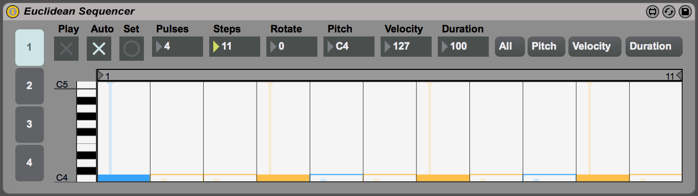

# Sidewinder: Euclidean Sequencer for Max for Live

An Euclidean Sequencer written in [Max for Live](https://www.ableton.com/en/live/max-for-live/) for use in [Ableton Live](https://www.ableton.com/en/live/). Example with four pulses (notes) positioned as equidistant as possible in eleven steps:

The [Euclidean algorithm](https://en.wikipedia.org/wiki/Euclidean_algorithm) computes greatest common divisor of two numbers. Godfried Toussaint discovered its musical applications and published them in ["The Euclidean Algorithm Generates Traditional Musical Rhythms"](http://cgm.cs.mcgill.ca/~godfried/publications/banff.pdf). Applied to music, the algorithm takes `k` pulses (notes) and distributes them as equidistant as possible in `n` steps.

It turns out that equidistant distribution is a key to creating rhythms that are inherently musical. An extraordinary number of traditional rhythms can be generated through this simple process, see the [Example Rhythms](#example-rhythms) section.

## Interface

- Track Tabs: There are four tracks tabs that can be selected on the right, all of the rest of the sections are per track (except "Presets").

### Presets Section

- `r`: Read presets from a file
- `w`: Write the presets to a file
- Toggle: Write the presets again to the same file

### Track Section

- **Play**: Whether this track outputs MIDI notes
- **Auto**: When on, moving a control automatically updates the steps (when off, use the "Set" button to set the steps)
- **Set**: When **Auto** is off, this sets the steps based on the current settings
- **Pulses**: The number of notes
- **Steps**: The total number of steps
- **Rotate**: Offset the notes
- **Pitch**: The pitch of the notes (this can also be changed in the step sequencer)
- **Velocity**: The velocity of the notes (this can also be changed in the step sequencer)
- **Duration**: The duration of the notes (this can also be changed in the step sequencer)
- **All** & **Pitch** & **Velocity** & **Duration**: Change what is displayed in the step sequencer

## Installation

Drag `max-for-live/Sidewinder.amxd` to `Ableton/User Library/Presets/MIDI Effects/Max MIDI Effect/`. There's an optional `install.sh` script that will do this automatically.

## JavaScript Implementation

Two JavaScript implementations of the algorithm are included (annotated as [Literate CoffeeScript](http://coffeescript.org/#literate)):

* [`bjorklund.litcoffee`](source/src/coffee/bjorklund.litcoffee): This follows the description of the algorithm verbatim from ["Structural properties of Euclidean rhythms"](http://student.ulb.ac.be/~ptaslaki/publications/structuralProperties.pdf), but it also gets slightly different results than the examples listed in Toussaint's other paper.
* [`toussaint.litcoffee`](source/src/coffee/toussaint.litcoffee): This version is slightly more elegant, and it's corrected to get identical results to the examples listed in ["The Euclidean Algorithm Generates Traditional Musical Rhythms"](http://cgm.cs.mcgill.ca/~godfried/publications/banff.pdf).

The sequencer uses the `toussaint` version by default.

## Example Rhythms

["The Euclidean Algorithm Generates Traditional Musical Rhythms"](http://cgm.cs.mcgill.ca/~godfried/publications/banff.pdf) contains a number of example inputs (`k` and `n`) that result in traditional rhythms:

* `E(2,3) = [x . x]` is a common Afro-Cuban drum pattern. For example, it is the conga rhythm of the 6/8-time Swing Tumbao. It is also common in Latin American music, as for example in the Cueca.
* `E(2,5) = [x . x . .]` is a thirteenth century Persian rhythm called Khafif-e-ramal. It is also the metric pattern of the second movement of Tchaikovsky’s Symphony No. 6. When it is started on the second onset (`[x . . x .]`) it is the metric pattern of Dave Brubeck’s Take Five as well as Mars from The Planets by Gustav Holst.
* `E(3,4) = [x . x x]` is the archetypal pattern of the Cumbia from Colombia [20], as well as a Calypso rhythm from Trinidad. It is also a thirteenth century Persian rhythm called Khalif-e-saghil, as well as the trochoid choreic rhythmic pattern of ancient Greece.
* `E(3,5) = [x . x . x]`, when started on the second onset, is another thirteenth century Persian rhythm by the name of Khafif-e-ramal, as well as a Rumanian folk-dance rhythm.
* `E(3,7) = [x . x . x . .]` is a Ruchenitza rhythm used in a Bulgarian folk-dance. It is also the metric pattern of Pink Floyd’s Money.
* `E(3,8) = [x . . x . . x .]` is the Cuban tresillo pattern discussed in the preceding.
* `E(4,7) = [x . x . x . x]` is another Ruchenitza Bulgarian folk-dance rhythm. > `E(4,9) = [x.x.x.x..]` is the Aksak rhythm of Turkey. It is also the metric pattern used by Dave Brubeck in his piece Rondo a la Turk.
* `E(4,11) = [x . . x . . x . . x .]` is the metric pattern used by Frank Zappa in his piece titled Outside Now. `E(5,6) = [x . x x x x]` yields the York-Samai pattern, a popular Arab rhythm, when started on the second onset.
* `E(5,7) = [x . x x . x x]` is the Nawakhat pattern, another popular Arab rhythm.
* `E(5,8)=[x . x x . x x .]` is the Cuban cinquillo pattern discussed in the preceding. When it is started on the second onset it is also the Spanish Tango and a thirteenth century Persian rhythm, the Al-saghil- al-sani.
* `E(5,9) = [x . x . x . x . x]` is a popular Arab rhythm called Agsag-Samai. When started on the second onset, it is a drum pattern used by the Venda in South Africa, as well as a Rumanian folk-dance rhythm.
* `E(5,11) = [x . x . x . x . x . .]` is the metric pattern used by Moussorgsky in Pictures at an Exhibition. `E(5,12) = [x . . x . x . . x . x .]` is the Venda clapping pattern of a South African children’s song.
* `E(5,16) = [x..x..x..x..x....]` is the Bossa-Nova rhythm necklace of Brazil. The actual Bossa-Nova rhythm usually starts on the third onset as follows: `[x . . x . . x . . . x . . x . .]`. However, there are other starting places as well, as for example `[x . . x . . x . . x . . . x . .]`.
* `E(7,8) = [x . x x x x x x]` is a typical rhythm played on the Bendir (frame drum), and used in the accompaniment of songs of the Tuareg people of Libya.
* `E(7,12) = [x . x x . x . x x . x .]` is a common West African bell pattern. For example, it is used in the Mpre rhythm of the Ashanti people of Ghana.
* `E(7,16) = [x . . x . x . x . . x . x . x .]` is a Samba rhythm necklace from Brazil. The actual Samba rhythm is `[x . x . . x . x . x . . x . x .]` obtained by starting `E(7,16)` on the last onset. When `E(7,16)` is started on the fifth onset it is a clapping pattern from Ghana.
* `E(9,16) = [x.xx.x.x.xx.x.x.]` is a rhythm necklace used in the Central African Republic. When it is started on the fourth onset it is a rhythm played in West and Central Africa, as well as a cow-bell pattern in the Brazilian samba. When it is started on the penultimate onset it is the bell pattern of the Ngbaka-Maibo rhythms of the Central African Republic.
* `E(11,24) = [x . . x . x . x . x . x . . x . x . x . x . x .]` is a rhythm necklace of the Aka Pygmies of Central Africa [2]. It is usually started on the seventh onset.
* `E(13,24) = [x . x x . x . x . x . x . x x . x . x . x . x .]` is another rhythm necklace of the Aka Pygmies of the upper Sangha. It is usually started on the fourth onset.
