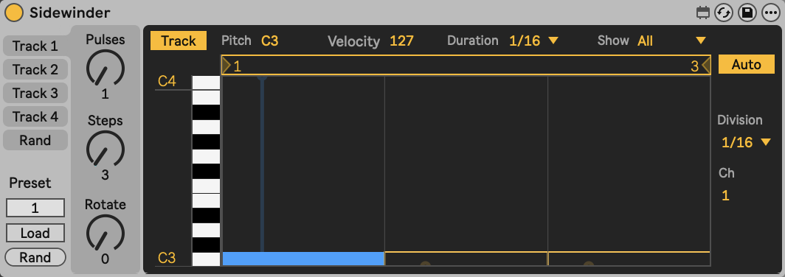
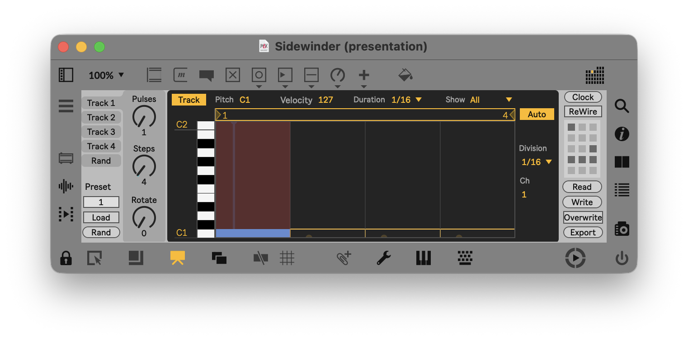
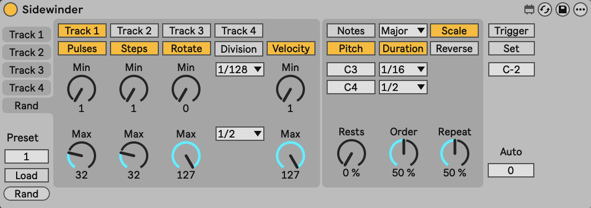

# Sidewinder

Sidewinder is a Euclidean sequencer for [Max for Live](https://www.ableton.com/en/live/max-for-live/) that creates polyrhythms. Sidewinder takes a number of pulses (notes) and positions them as equidistant as possible into a number of steps. Equidistant distribution is a key to creating rhythms that are inherently musical. Many traditional rhythms can be generated through this simple process, see the [example rhythms](#example-rhythms) section.

The [Euclidean algorithm](https://en.wikipedia.org/wiki/Euclidean_algorithm) computes greatest common divisor of two numbers. Godfried Toussaint discovered its musical applications and published them in ["The Euclidean Algorithm Generates Traditional Musical Rhythms"](http://cgm.cs.mcgill.ca/~godfried/publications/banff.pdf). Applied to music, the algorithm takes `k` pulses (notes) and distributes them as equidistant as possible in `n` steps.

## Installation

### Freezing the `.amxd`

Before the device is added to the `User Library` in Ableton Live or Ableton Push, the device should be frozen.

The latest version of the frozen device can be downloaded from [the Sidewinder page on the Max for Live site](https://maxforlive.com/library/device/5794/sidewinder).

The device can be frozen manually by following these steps:

1. Open Ableton Live and drag `Sidewinder/Sidewinder.amxd` to the Device area (where it says `Drop an instrument or Sample here`).
2. Click the disclosure icon in the upper right of the device and choose `Edit in Max`.
3. In the Max window, click the `Freeze Device` icon in the bottom bar that looks like a snow flake, then choose `File > Save As...` to save the frozen device to a temporary location.

Note that this file can be deleted after the device has been added to the `User Library`.

### Installing in Ableton Live

Drag the frozen `Sidewinder.amxd` to the `User Library` (e.g., under `User Library/Presets/MIDI Effects/Max MIDI Effect/`).

### Installing in Ableton Push standalone mode

1. Launch Push in standalone mode
2. In Live's sidebar, select `Places > Push`
3. Drag the frozen `Sidewinder.amxd` to `Places > Push > User Library` (e.g., under `User Library/Presets/MIDI Effects/Max MIDI Effect/` [note that in the Push Use Library this folder is *not* create by default like it is in the Live User Library]).

### Using the Device on Push

After Sidewinder has been installed in the Push `User Library`, the device can be added by choosing it under `Device > User Library`.

## Opening in Max Directly

To open in Max directly without Live, open `Sidewinder/Sidewinder.maxpat`, Sidewinder has some some additional features when opened outside of Live:

- **ReWire**: Toggles whether to use a ReWire host as a clock source
- **Clock**: Show the global transport

## Presets

Presets are available either when opening in Max directly, or by choosing `Edit in Max` in Live (and dragging the Max window size larger to expose the preset controls).

- **Read**: Read presets from a file
- **Write**: Write the presets to a file
- **Overwrite**: When toggled on, **Write** will automatically write again to the sample file
- **Export**: Export the notes dictionary as JSON (this can then be imported into a MIDI region using a MIDI generator or transformer that supports imports like [Middleware](https://github.com/robenkleene/middleware))
- To recall a preset, click a box
- To save a preset, shift-click a box
- To delete a preset, shift-option-click a box

## Parameter Reference

### Global

- **Track 1-4**: Select which track to display
- **Rand** tab: Display the randomize pan
- **Rand** button: Trigger randomize
- **Select**: Choose the selected preset
- **Load**: Toggle whether selecting a preset automatically loads it (this will also load the current selected preset)

### Pulses

To the left of the piano roll.

- **Pulses**: Set the number of pulses (notes)
- **Steps**: Set the total number of steps
- **Rotate**: Set the offset for the pulses

### Sequencer

- **Track**: Toggle playback for this track
- **Pitch**: Set the pitch of the notes
- **Velocity**: Set the velocity of the notes
- **Duration**: Set the duration of the notes. The note duration can only be set to `1/128` `1/64`, `1/32`, `1/16`,  `1/8`, `1/4`, or `1/2` notes (there appears to be an undocumented limitation of the [`live.step`](https://docs.cycling74.com/max8/refpages/live.step) sequencer that limits the minimum duration to `7.5` ticks and the maximum duration to `960` ticks).
- **Show**: Select between showing **All**, **Pitch**, **Velocity**, or  **Duration** in the step sequencer
- **Set** (only visible when `Auto` is toggled off): Set the steps based on the current settings
- **Auto**: Toggle whether moving a control automatically updates the steps. The step sequencer can only be manually edited if toggled off.
- **Division**: Sets the value between each step (this is different than **Duration**, which can for example overlap steps). There's limitation with the [`live.step`](https://docs.cycling74.com/max8/refpages/live.step) sequencer that each step in the sequencer represents `1/16` note, this means the display of the sequencer will actually be different from the MIDI output, if this value is set to anything other than `1/16`.
- **Ch**: The MIDI channel that the track outputs to (note that Ableton Live actually merges all MIDI to channel one, limiting the usefulness of this in Live)
- Directions (only visible when `Auto` is toggled off): Move the sequencer note pitches up, down, left, or right. If **Show** is set to `Velocity` or `Duration`, then velocity or duration values are affected instead.

### Randomize

Randomize generates a random sequence. The **Notes** setting is significant, with that setting turned off, a sequence that plays a single note will be generated. If it's turned on, a sequence playing different notes from a scale will be generated.

- **Track 1-4**: Which tracks to randomize
- **Pulses, Steps, Rotate**: Whether to randomize those parameters. When randomizing pulses and steps, the randomized steps value *overrides the maximum for pulses* (unless the randomize pulses maximum is already less than the randomized steps value). This is because the pulses value can never go above steps value, so if we didn't override the maximum for pulses, then all randomized pulses values above the randomized steps value would be forced to be the steps value (i.e., steps and pulses values would be equal, which doesn't make for interesting patterns).
- **Min**: Minimum random amount
- **Max**: Maximum random amount
- **Notes**: Whether to randomize individual notes. If the notes is off, then randomize for Velocity, Pitch, and Duration will randomize changing those values on the individual track settings. If notes is on, then randomize for those values will create randomize the individual notes (and the track settings will be used for default values, e.g., for off notes with a velocity of 0).
- For Duration, the top number and bottom numbers are the minimum and maximum duration in ticks
- For Pitch, the top number and bottom pitches are the minimum and maximum pitches
- **Note Trigger**: If the incoming MIDI note matches this note, than randomize is triggered (i.e., this is a way to trigger randomize via MIDI)
- **Set Note Trigger**: The next incoming note will set the note trigger value without triggering randomize
- **Auto Beats**: Automatically trigger a randomize after every number of beats (this is based on the current transport status, e.g., if it's set to `4` and you're currently on beat `2`, it'll trigger the randomize in `2` more beats)

#### Pitch Note Controls

With the **Notes** is off, only the minimum and maximum pitches are used. If **Notes** is on, Sidewinder generates a note sequence and provides additional parameters to randomize the sequence. If all the additional randomization parameters are off, the sequence generated will simply generate notes in the selected scale in order.

- **Velocity**: Whether to randomize velocity
- **Pitch**: Whether to randomize pitch
- **Duration**: Whether to randomize duration
- **Scale**: The scale the sequence will be generated in
- **Rand**: Randomize the scale
- **Reverse**: Reverse the order of the generated sequence (i.e., from ascending to descending)
- **Repeat, Order, Rests**: The percentage chance that each note will be affected when generating the note sequence. Repeat is the percentage chance each note will be repeated, Order is the percentage change each note will be have it's position in the sequence randomized, and Rests is the percentage chance the note will be replaced by a rest. **Note:** Rests use a velocity of `0`, so rests will result in `0` velocity notes, even though the `VelMin` minimum is `0`, which can be surprising if you aren't expecting it.

## Installation

Drag `max-for-live/Sidewinder.amxd` to `Ableton > User Library/Presets/MIDI Effects/Max MIDI Effect/`.

## Source Files

To open any of the `maxpat` files, the Sidewinder folder should be in your [Project Search Paths](https://docs.cycling74.com/max8/vignettes/projects_searchpath), `~/Documents/Max 8/Projects` by default, so that referenced files can be found.

## JavaScript Implementation

Two JavaScript implementations of the algorithm are included (annotated as [Literate CoffeeScript](http://coffeescript.org/#literate)):

- [`Bjorklund.js`](Sidewinder/Bjorklund.js): This follows the description of the algorithm verbatim from ["Structural properties of Euclidean rhythms"](http://student.ulb.ac.be/~ptaslaki/publications/structuralProperties.pdf), but it also gets slightly different results than the examples listed in Toussaint's other paper.
- [`Toussaint.js`](Sidewinder/Toussaint.js): This version is slightly more elegant, and it's corrected to get identical results to the examples listed in ["The Euclidean Algorithm Generates Traditional Musical Rhythms"](http://cgm.cs.mcgill.ca/~godfried/publications/banff.pdf).

The sequencer uses the `toussaint` version by default.

## Ableton Push

Sidewinder supports Ableton Push. The first knob always controls which tab is visible. There's `Main` and `Play` banks for each of the four tracks, and the randomize parameters are across `Randomize`, `Toggles`, `Tracks`, `Ranges`, `Notes`, and `Trigger`.

## Patterns

See a [list of example inputs to generate traditional rhythms](patterns.md).

## Presets

1. **Init**: Default state
2. **Randomize Rhythm**: Randomize settings for rhythms
3. **Randomize Melody**: Randomize settings for melodies
4. **House**: 4/4 rhythm demo
5. **Latin**: Hand percussion demo
6. **Polyrhythm**: Polyrhythm demo
7. **Mutate**: 4/4 rhythm demo that randomizes

## Demos

- [House](assets/demo/house.wav): 4/4 rhythm demo
- [Latin](assets/demo/latin.wav): Hand percussion demo
- [Polyrhythm](assets/demo/polyrhythm.wav): Polyrhythm demo
- [Mutate](assets/demo/mutate.wav): 4/4 rhythm demo that randomizes

### Reconstructing

To reconstruct this demo loops in Ableton Live, setup a track with Sidewinder with the appropriate demo preset loaded, followed by a Drum Rack with the first four slots slots (`C1-D#1`) using the named preset from [Thwomp](https://github.com/robenkleene/thwomp).

#### House

1. Kick
2. Snare
3. Hi-Hat
4. Cymbal

#### Latin

1. Bongo Low
2. Bongo High
3. Conga Low
4. Conga High

#### Polyrhythm

1. 808 Kick
2. Hi-Hat
3. Tom
4. Cowbell

#### Mutate

1. 909 Kick
2. Clap
3. Hi-Hat
4. Cymbal
